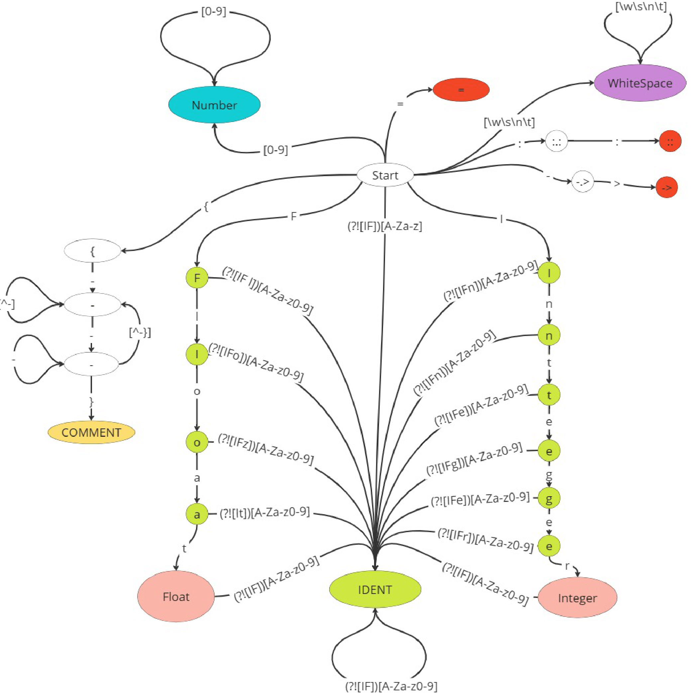

% Лабораторная работа № 1.4 «Лексический распознаватель»
% 18 марта 2025 г.
% Талгат Сатыбалдиев, ИУ9-62Б

# Цель работы
Целью данной работы является изучение использования детерминированных конечных автоматов с размеченными
заключительными состояниями (лексических распознавателей) для решения задачи лексического анализа

# Индивидуальный вариант
Integer, Float, ::, ->, =, комментарии ограничены знаками {-, -}, могут пересекать границы строк текста.

# Реализация

Лексическая структура языка — регулярные выражения для доменов:
```
IDENT = [a-zA-Z][a-zA-Z0-9]*
NUM = [0-9][0-9]*
KEYWORD = Integer | Float
OP = :: | -> | = 
COMMENT {- .* -}
```


Граф детерминированного распознавателя:



Реализация распознавателя:


Файл `Token.py`:
``` python
from abc import abstractmethod
import copy
import sys
import unicodedata
from enum import Enum
class Position:
    def __init__(self, text):
        self.text = text
        self.line = 1
        self.pos = 1
        self.index = 0
    def update_text(self, new_text):
        """
        Обновляет текст и сбрасывает индекс, но сохраняет текущие значения line и pos.
        """
        self.text = new_text
        self.index = 0  # Сбрасываем индекс
    @property
    def line(self):
        return self._line

    @line.setter
    def line(self, value):
        self._line = value

    @property
    def pos(self):
        return self._pos

    @pos.setter
    def pos(self, value):
        self._pos = value

    @property
    def index(self):
        return self._index

    @index.setter
    def index(self, value):
        self._index = value
    
    @property 
    def cp(self):
        if self.index == len(self.text):
            return -1
        return ord(self.text[self.index])
    @property 
    def str(self):
        if self.index == len(self.text):
            return ""
        return self.text[self.index:self.index+1]
    @property
    def uc(self):
        if self.index == len(self.text):
            return unicodedata.category(' ')
        return unicodedata.category(self.text[self.index])

    @property
    def is_white_space(self):
        return self.index != len(self.text) and self.text[self.index].isspace()

    @property
    def is_letter(self):
        return self.index != len(self.text) and self.text[self.index].isalpha()

    @property
    def is_letter_or_digit(self):
        return self.index != len(self.text) and self.text[self.index].isalnum()

    @property
    def is_decimal_digit(self):
        return self.index != len(self.text) and self.text[self.index].isdigit()

    @property
    def is_new_line(self):
        if self.index == len(self.text):
            return True
        if self.text[self.index] == '\r' and self.index + 1 < len(self.text):
            return self.text[self.index + 1] == '\n'
        return self.text[self.index] == '\n'

    def __iadd__(self, other):
        if self.index < len(self.text):
            if self.is_new_line:
                if self.text[self.index] == '\r':
                    self.index += 1
                self.line += 1
                self.pos = 1
            else:
                if unicodedata.category(self.text[self.index]) == 'Cs':
                    self.index += 1
                self.pos += 1
            self.index += 1
        return self
    def __isub__(self, other):
        """Перемещает позицию назад на `other` символов."""
        for _ in range(other):
            if self.index <= 0:
                break  # Нельзя уйти ниже нулевого индекса
            self.index -= 1  # Перемещаемся на один символ назад

            # Если текущий символ — это символ новой строки, обновляем line и pos
            if self.index > 0 and self.text[self.index - 1] == '\n':
                self.line -= 1
                # Вычисляем pos как длину строки до текущего символа
                self.pos = self.text.rfind('\n', 0, self.index - 1)
                if self.pos == -1:
                    self.pos = self.index
                else:
                    self.pos = self.index - self.pos - 1
            elif self.index > 0 and self.text[self.index - 1] == '\r':
                # Обработка случая с \r\n
                if self.index > 1 and self.text[self.index - 2] == '\n':
                    self.line -= 1
                    self.pos = self.text.rfind('\n', 0, self.index - 2)
                    if self.pos == -1:
                        self.pos = self.index - 1
                    else:
                        self.pos = self.index - self.pos - 2
                else:
                    self.line -= 1
                    self.pos = 1
            else:
                self.pos -= 1
        return self

    def __str__(self):
        return f"({self.line}, {self.pos})"

    def __lt__(self, other):
        return self.index < other.index

    def __eq__(self, other):
        return self.index == other.index

    def __le__(self, other):
        return self.index <= other.index

    def __gt__(self, other):
        return self.index > other.index

    def __ge__(self, other):
        return self.index >= other.index

    def __ne__(self, other):
        return self.index != other.index
class Fragment:
    def __init__(self, starting, following):
        self._starting = copy.copy(starting)  # Копируем starting
        self._following = copy.copy(following)  # Копируем following
        
    @property
    def starting(self):
        return self._starting

    @property
    def following(self):
        return self._following
    @property
    def str(self):
        return self._starting.text[self._starting.index : self._following.index]
    
    def __str__(self):
        return f"{self.starting}-{self.following}"
class Message:
    def __init__(self, is_error, text):
        self._is_error = is_error
        self._text = text

    @property
    def is_error(self):
        return self._is_error

    @property
    def text(self):
        return self._text

    def __str__(self):
        return f"{'Error' if self.is_error else 'Message'}: {self.text}"
class DomainTag(Enum):
    IDENT = 0          # Идентификатор
    NUMBER = 1         # Число
    COMMENT = 2 
    KeyWord = 3
    OP = 4
    END_OF_PROGRAM = 99
    WhiteSpace = 100
  
class Token():
    def __init__(self, tag,value, starting, following):
        self._tag = tag
        self._value = value
        self._coords = Fragment(starting, following)
    def __init__(self, tag,value, coords):
        self._tag = tag
        self._value = value
        self._coords = coords
    @property
    def tag(self):
        return self._tag

    @property
    def coords(self):
        return self._coords
    @property
    def get_value(self):
        return self._value
    
    def __str__(self):
        return f"{self.tag.name} {self.coords}: {self.get_value}"
```
Файл `main.py`:
```python
from enum import Enum
import re
import Token as tk
import copy
from Token import DomainTag
class CLS(Enum):
    CHR_SPEC = 0          # строчные символы без I n t e g r F l o a t : - > 
    NUM = 1               # Число 
    I = 3                # Символ 'I'
    n = 4                # Символ 'n'
    t = 5                # Символ 't'
    e = 6                # Символ 'e'
    g = 7                # Символ 'g'
    r = 8                # Символ 'r'
    F = 9                # Символ 'F'
    l = 10               # Символ 'l'
    a = 11               # Символ 'a'
    o = 12               # Символ 'o'
    COLON = 13           # Символ ':'
    GT = 14              # Символ '>'
    MIN = 15             # Символ '-'
    OAS = 16             # Символ '{'
    CAS = 17             # Символ '}'
    EQ = 18              # Символ '='  
    EOF = 99             # Конец файла (End of File)
    WS = 100             # Пробельный символ (Whitespace)
    Other = 101          # другие символы 
def getCLS(x: str) -> CLS:
    if len(x) != 1:
        raise ValueError("Input must be a single character")

    if x.isdigit():
        return CLS.NUM
    elif x == 'I':
        return CLS.I
    elif x == 'n':
        return CLS.n
    elif x == 't':
        return CLS.t
    elif x == 'e':
        return CLS.e
    elif x == 'g':
        return CLS.g
    elif x == 'r':
        return CLS.r
    elif x == 'F':
        return CLS.F
    elif x == 'l':
        return CLS.l
    elif x == 'o':
        return CLS.o
    elif x == 'a':
        return CLS.a
    elif x == ':':
        return CLS.COLON
    elif x == '>':
        return CLS.GT
    elif x == '-':
        return CLS.MIN
    elif x == '{':
        return CLS.OAS
    elif x == '}':
        return CLS.CAS
    elif x == '=':
        return CLS.EQ
    elif x.isspace():
        return CLS.WS
    elif x.isalpha() and x not in {'I', 'n', 't', 'e', 'g', 'r', 'F', 'l', 'o', 'a'}:
        return CLS.CHR_SPEC
    else:
        return CLS.Other  
class Graph:
    def __init__(self):
        self.graph = {}
        self.final = {}

    def add_vertex(self, vertex):
        if vertex not in self.graph:
            self.graph[vertex] = set()

    def add_edge(self, vertex1, vertex2, regex):
        if vertex1 not in self.graph:
            self.add_vertex(vertex1)
        if vertex2 not in self.graph:
            self.add_vertex(vertex2)
        
        if isinstance(regex, list):
            for r in regex:
                self.graph[vertex1].add((vertex2, r))
        else:
            self.graph[vertex1].add((vertex2, regex))
    def add_final_vertices(self,vertex,domain_name):
        if vertex not in self.graph:
            self.add_vertex(vertex)
        self.final[vertex] = domain_name
    def get_vertices(self):
        return list(self.graph.keys())
    

    def get_edges(self):
        edges = []
        for vertex in self.graph:
            for adjacent_vertex in self.graph[vertex]:
                if (adjacent_vertex, vertex) not in edges:  # Чтобы избежать дублирования в неориентированном графе
                    edges.append((vertex, adjacent_vertex))
        return edges

    def __str__(self):
        dot =  "digraph G {\n"
        for vertex in self.graph:
            if vertex in self.final:
                dot += f'    "{vertex}" [shape="doubleoctagon"];\n'
            else :
                dot += f'    "{vertex}";\n'

            
        for vertex, adjacents in self.graph.items():
            for adj,regex in adjacents:
                  # Для неориентированного графа избегаем дублирования рёбер
                dot += f'    "{vertex}" -> "{adj}" [label="{regex}"];\n' 
        dot += "}"
        return dot
    def csacademy_format(self):
        dot = ""
        
        # Добавляем вершины
        for vertex in self.graph:
            if vertex in self.final:
                dot += f'"{vertex}_finish"\n'
            else:
                dot += f'"{vertex}"\n'
        
        # Добавляем рёбра
        for vertex, adjacents in self.graph.items():
            for adj, regex in adjacents:
                # Определяем имена вершин с учётом приставки _finish
                start_vertex = f'"{vertex}_finish"' if vertex in self.final else f'"{vertex}"'
                end_vertex = f'"{adj}_finish"' if adj in self.final else f'"{adj}"'
                
                # Добавляем ребро с меткой
                dot += f'{start_vertex} {end_vertex} "{regex}"\n'
        
        return dot
    def traverse(self, start_vertex, pos):
        final_vertices_reached = []
        prev_pos = copy.copy(pos)
        
        if pos.cp < 0:
            fragm = tk.Fragment(pos,pos)
            return (tk.Token(DomainTag.END_OF_PROGRAM,"",fragm), pos) 
        def dfs(current_vertex, pos):
            if pos.cp < 0:
                if current_vertex in self.final:
                    final_vertices_reached.append((current_vertex, pos))
                
                return True  # Строка полностью пройдена
            
            # print(current_vertex , " \" ",pos.str,"\"",end= " ")
            
            for neighbor, regex in self.graph.get(current_vertex, []):
                _pos = copy.copy(pos)
                _pos+=1

                if getCLS(pos.str)==regex  and dfs(neighbor, _pos):
                    if current_vertex in self.final:
                        final_vertices_reached.append((current_vertex, pos))
                    return True
            if current_vertex in self.final:
                final_vertices_reached.append((current_vertex, pos))
            return False

        dfs(start_vertex, pos)
        if len(final_vertices_reached) == 0 :
             ps = copy.copy(prev_pos)
             prev_pos+=1
             fragm = tk.Fragment(ps,prev_pos)
             
             return (tk.Token(DomainTag.ERROR,fragm.str,fragm),prev_pos)
        
        vertex,pos =final_vertices_reached[0]
        fragm = tk.Fragment(prev_pos,pos)
        
        return (tk.Token(self.final[vertex],fragm.str,fragm), pos)
# Пример использования
class Lexer:
    def __init__(self,graph,text):
        self.graph = graph
        self.text = text
        self.pos = tk.Position(text)
    def next_token(self):
        Token,_pos = g.traverse("Start", self.pos )
        # print("first token=",Token)
      
        while Token.tag ==  DomainTag.WhiteSpace : 
            Token,_pos = g.traverse("Start", _pos)
            
        self.pos = _pos 
        return Token
def graph_init():
    g = Graph()
    edges = [
   ("Start","WhiteSpace", CLS.WS),
   ("WhiteSpace","WhiteSpace", CLS.WS),
   ("Start","Number", CLS.NUM),
   ("Number","Number", CLS.NUM),
   ("Start","IDENT",[CLS.CHR_SPEC, CLS.n,CLS.t,CLS.e,CLS.g,CLS.r,CLS.l,CLS.o,CLS.a]),
   ("Start","I", CLS.I),
   ("Start","F",CLS.F),
   ("I","n", CLS.n),
   ("I","IDENT", [CLS.CHR_SPEC,CLS.NUM,CLS.I,CLS.t,CLS.e,CLS.g,CLS.r,CLS.F,CLS.l,CLS.o,CLS.a]),
   ("n","t", CLS.t),
   ("n","IDENT", [CLS.CHR_SPEC,CLS.NUM,CLS.I,CLS.n,CLS.e,CLS.g,CLS.r,CLS.F,CLS.l,CLS.o,CLS.a]),
   ("t","e", CLS.e),
   ("t","IDENT", [CLS.CHR_SPEC,CLS.NUM,CLS.I,CLS.n,CLS.t,CLS.g,CLS.r,CLS.F,CLS.l,CLS.o,CLS.a]),
   ("e","g", CLS.g),
   ("e","IDENT",[CLS.CHR_SPEC,CLS.NUM,CLS.I,CLS.n,CLS.t,CLS.e,CLS.r,CLS.F,CLS.l,CLS.o,CLS.a]),
   ("g","e1", CLS.e),
   ("g","IDENT", [CLS.CHR_SPEC,CLS.NUM,CLS.I,CLS.n,CLS.t,CLS.g,CLS.r,CLS.F,CLS.l,CLS.o,CLS.a]),
   ("e1","Integer", CLS.r),
   ("e1","IDENT", [CLS.CHR_SPEC,CLS.NUM,CLS.I,CLS.n,CLS.t,CLS.e,CLS.g,CLS.F,CLS.l,CLS.o,CLS.a]),
   ("Integer","IDENT",[CLS.CHR_SPEC,CLS.NUM,CLS.I,CLS.n,CLS.t,CLS.e,CLS.g,CLS.r,CLS.F,CLS.l,CLS.o,CLS.a]),
   ("F", "l", CLS.l),
   ("F", "IDENT", [CLS.CHR_SPEC,CLS.NUM,CLS.I,CLS.n,CLS.t,CLS.e,CLS.g,CLS.r,CLS.F,CLS.l,CLS.o,CLS.a]),
   ("l", "o", CLS.o),
   ("l", "IDENT", [CLS.CHR_SPEC,CLS.NUM,CLS.I,CLS.n,CLS.t,CLS.e,CLS.g,CLS.r,CLS.F,CLS.l,CLS.a]),
   ("o", "a", CLS.a),
   ("o", "IDENT",[CLS.CHR_SPEC,CLS.NUM,CLS.I,CLS.n,CLS.t,CLS.e,CLS.g,CLS.r,CLS.F,CLS.l,CLS.o]),
   ("a", "Float", CLS.t),
   ("a", "IDENT", [CLS.CHR_SPEC,CLS.NUM,CLS.I,CLS.n,CLS.e,CLS.g,CLS.r,CLS.F,CLS.l,CLS.o,CLS.a]),
   ("Float", "IDENT",[CLS.CHR_SPEC,CLS.NUM,CLS.I,CLS.n,CLS.t,CLS.e,CLS.g,CLS.r,CLS.F,CLS.l,CLS.o,CLS.a]) , 
   ("IDENT","IDENT",[CLS.CHR_SPEC,CLS.NUM,CLS.I,CLS.n,CLS.t,CLS.e,CLS.g,CLS.r,CLS.F,CLS.l,CLS.o,CLS.a]),
   ("Start","{", CLS.OAS),
   ("{","-", CLS.MIN),
   ("-","-", [CLS.CHR_SPEC,CLS.NUM,
              CLS.I,CLS.n,CLS.t,CLS.e,CLS.g,CLS.r,
              CLS.F,CLS.l,CLS.o,CLS.a,
              CLS.Other,CLS.COLON,CLS.WS,CLS.GT,CLS.OAS,CLS.CAS]),
    ("_","-", [CLS.CHR_SPEC,CLS.NUM,
              CLS.I,CLS.n,CLS.t,CLS.e,CLS.g,CLS.r,
              CLS.F,CLS.l,CLS.o,CLS.a,
              CLS.Other,CLS.COLON,CLS.WS,CLS.GT,CLS.OAS]),
    ("-","_", CLS.MIN),
    ("_","_", CLS.MIN),
    ("_","Comment", CLS.CAS),
    ("Start",":.:",CLS.COLON) ,
    (":.:","::",CLS.COLON) ,
    
    ("Start","-.>",CLS.MIN) ,
    ("-.>","->",CLS.GT) ,
    
    ("Start","=",CLS.EQ) ,
   ]
    final = [
    ("WhiteSpace",DomainTag.WhiteSpace),
    ("Comment",DomainTag.COMMENT),
    ("I",DomainTag.IDENT),
    ("n",DomainTag.IDENT),
    ("t",DomainTag.IDENT),
    ("e",DomainTag.IDENT),
    ("g",DomainTag.IDENT),
    ("e1",DomainTag.IDENT),
    ("Integer",DomainTag.KeyWord),
    ("F",DomainTag.IDENT),
    ("l",DomainTag.IDENT),
    ("o",DomainTag.IDENT),
    ("a",DomainTag.IDENT),
    ("Float",DomainTag.KeyWord),
    ("IDENT",DomainTag.IDENT),
    ("Number",DomainTag.NUMBER),
    ("::",DomainTag.OP),
    ("->",DomainTag.OP),
    ("=",DomainTag.OP),]
    list(map(lambda args: g.add_edge(*args), edges))
    list(map(lambda args: g.add_final_vertices(*args), final))
    return g    
g = graph_init()
# print(g)
input_string = ""
with open('text.txt', 'r', encoding='utf-8') as file:
    # Читаем содержимое файла в строку
    input_string = file.read()

lex = Lexer(g,input_string)

token = lex.next_token()
print(token) 
while (token.tag != DomainTag.END_OF_PROGRAM):
    token = lex.next_token()
    print(token)
token = lex.next_token()
print(token) 
```

# Тестирование

Входные данные

```
4545asd
= sad sad ==::===->
15451541asddsad15155151151515=
{-sadsa ------------------}
{- multi stoke comment
asdasdasdasdasdasda

asdasdasdasdasdasda
das


sdadda
asd23
123

12{}".;./'---
-} 

```

Вывод на `stdout`

```
NUMBER (1, 1)-(1, 5): 4545
IDENT (1, 5)-(1, 8): asd
OP (2, 1)-(2, 2): =
IDENT (2, 3)-(2, 6): sad
IDENT (2, 7)-(2, 10): sad
OP (2, 11)-(2, 12): =
OP (2, 12)-(2, 13): =
OP (2, 13)-(2, 15): ::
OP (2, 15)-(2, 16): =
OP (2, 16)-(2, 17): =
OP (2, 17)-(2, 18): =
OP (2, 18)-(2, 20): ->
NUMBER (3, 1)-(3, 9): 15451541
IDENT (3, 9)-(3, 30): asddsad15155151151515
OP (3, 30)-(3, 31): =
COMMENT (4, 1)-(4, 28): {-sadsa ------------------}
COMMENT (5, 1)-(17, 3): {- multi stoke comment
asdasdasdasdasdasda

asdasdasdasdasdasda
das


sdadda
asd23
123

12{}".;./'---
-}
END_OF_PROGRAM (18, 1)-(18, 1):
```

# Вывод
В ходе выполнения лабораторной работы № 1.4 «Лексический распознаватель» были изучены принципы работы 
детерминированных конечных автоматов (ДКА) с размеченными заключительными состояниями для решения задачи
лексического анализа. Была реализована программа, способная распознавать лексемы, соответствующие заданному
индивидуальному варианту: ключевые слова (Integer, Float), операторы (::, ->, =), числа, идентификаторы 
и комментарии, ограниченные знаками {- и -}.